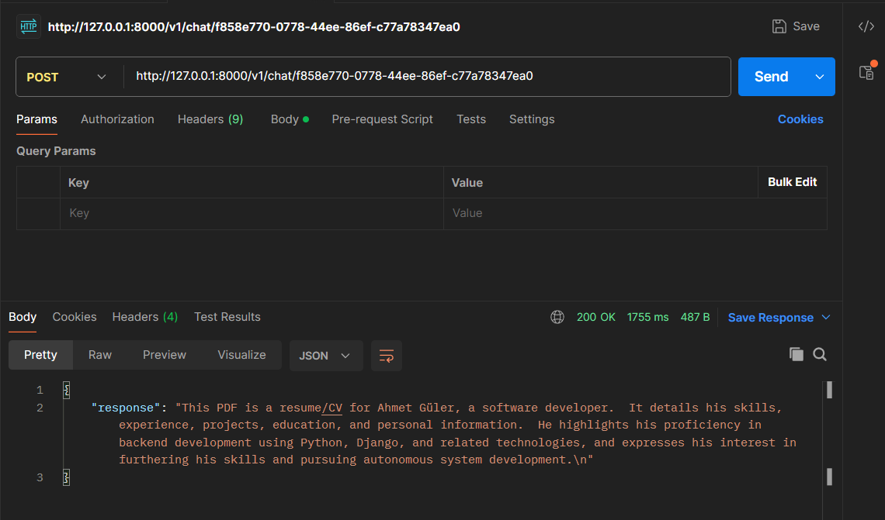

# PDF Chat API

FastAPI-based API system that allows you to upload PDF files and chat with them using Google Gemini AI.

## Features
- **PDF Processing**: Upload PDFs and extract text
- **AI Chat**: Ask questions about uploaded PDFs
- **Async Processing**: Asynchronous structure for fast responses  
- **Comprehensive Tests**: Full test coverage

## Technologies Used
- **Backend**: FastAPI, Python 3.9
- **PDF Processing**: PyPDF
- **AI Integration**: Google Gemini AI
- **Testing**: Pytest

## Setup and Installation

### Requirements
- Python 3.9
- Google Gemini AI API key

### Steps
1. Clone the repository:
   ```bash
   git clone https://github.com/your-username/pdf-chat-api.git
   cd pdf-chat-api
   ```

2. Create and activate virtual environment:
   - Windows:
     ```bash
     python -m venv .venv
     .\.venv\Scripts\activate.bat
     ```
   - Unix/MacOS:
     ```bash
     python -m venv .venv
     source .venv/bin/activate
     ```

3. Install requirements:
   ```bash
   pip install -r requirements.txt
   ```

4. Set environment variables:
   - Create `.env` file:
     ```bash
     echo GOOGLE_API_KEY=your_api_key_here > .env
     ```

5. Start the application:
   ```bash
   uvicorn app.main:app --reload
   ```

### API Endpoints
- **Upload PDF**: `POST /v1/pdf`
- **Chat with PDF**: `POST /v1/chat/{pdf_id}`

### Example Response
Get contextual answers to questions about your PDF:



### Running Tests
1. Make sure virtual environment is activated
2. Place a sample PDF file named `sample.pdf` in the `tests` directory
3. Run tests:
   ```bash
   pytest -v tests/
   ```

### Project Structure

## Contributing
Feel free to open issues or submit pull requests for improvements.

## License
This project is licensed under the MIT License.